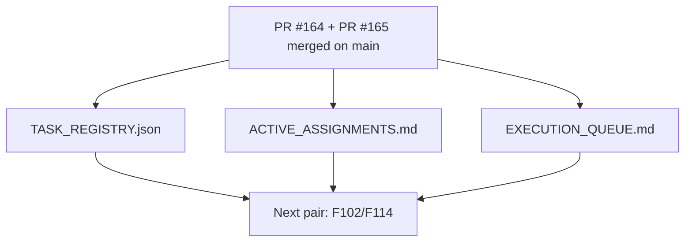

# PR Architecture Note: Post-F101/F113 Control-Plane Repair

## Summary

This PR repairs the AI-first control plane after both `F101_TEACHER_ACTION_EXECUTION_LOOP` and `F113_CAPABILITY_WIDE_RUNTIME_BINDING_COVERAGE` merged to `main`. It removes stale Session A and Session B assignment state, marks both tasks as completed in the task registry, and resets the queue so the next future-backlog work starts from a fresh Session A or Session B branch/worktree.

## Mermaid Diagram



## Files Changed

- `ai_first/ACTIVE_ASSIGNMENTS.md`
- `ai_first/EXECUTION_QUEUE.md`
- `ai_first/TASK_REGISTRY.json`
- `ai_first/daily/2026-04-26.md`
- `docs/superpowers/pr-notes/2026-04-26-post-165-f101-sync.md`

## Main System Map Update

`ai_first/architecture/MAIN_SYSTEM_MAP.md` was not updated. This PR only synchronizes AI-first task state after `F101` merged; it does not change runtime topology or product architecture.

## Validation

```bash
python -m json.tool ai_first/TASK_REGISTRY.json >/dev/null
git diff --check
```

## Handoff Notes

- `F101_TEACHER_ACTION_EXECUTION_LOOP` and `F113_CAPABILITY_WIDE_RUNTIME_BINDING_COVERAGE` are both complete on `main`.
- No AI implementation lane remains active by default after this repair lands.
- The next safe product pair is `F102/F103` for Session A and `F114/F116` for Session B.
