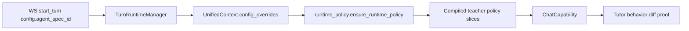

# PR Note: Risk Lane 1 Runtime Binding Proof

## Summary

- allow the chat request contract to accept `agent_spec_id` in live turn config
- add focused tests proving the unified Tutor turn path carries that id into runtime policy assembly
- add a behavioral diff test for two contrasting Agent Spec packs and recalibrate contest wording to the bounded proof level

## Architecture

## Main System Map

- Not updated. This lane proves and documents an existing runtime path; it does not introduce a new architectural boundary.

## Validation

- `pytest tests/services/runtime_policy/test_compiler.py tests/core/test_capabilities_runtime.py tests/api/test_unified_ws_turn_runtime.py -q`
- `git diff --check`
