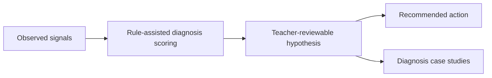

# PR Note: Risk Lane 2 Diagnosis Credibility

## Summary

- make diagnosis payloads explicitly teacher-reviewed and rule-assisted
- add abstain reasoning and teacher-review notes to diagnosis and recommendation outputs
- document three judge-facing diagnosis case studies without inventing benchmark accuracy claims

## Architecture

## Main System Map

- Not updated. This lane strengthens framing and payload semantics inside the existing evidence pipeline without changing architectural boundaries.

## Validation

- `pytest tests/services/evidence/test_diagnosis.py tests/api/test_assessment_router.py tests/api/test_dashboard_router.py -q`
- `git diff --check`
