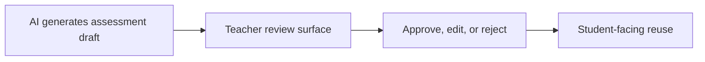

# PR Note: Risk Lane 3 Assessment Safety

## Summary

- add visible teacher-review safety-gate messaging to the generated assessment and assessment-review surfaces
- calibrate contest wording so assessment quality claims rely on human review, not hidden model infallibility
- correct the lane packet to match the real assessment UI files used in this repository

## Architecture

## Main System Map

- Not updated. This lane clarifies an existing assessment review gate without changing architectural boundaries.

## Validation

- `./node_modules/.bin/eslint --config eslint.config.mjs components/quiz/QuizViewer.tsx app/'(workspace)'/dashboard/assessments/'[sessionId]'/page.tsx`
- `git diff --check`
