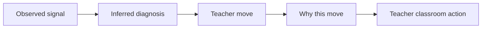

# PR Note: Risk Lane 5 Dashboard Actionability

## Summary

This PR hardens the teacher dashboard against the “looks smart but what should I do?” critique by turning recommendation copy into explicit teacher moves backed by visible reasons.

## What Changed

- reframed student cards around `Teacher move` and `Why this move`
- reframed small-group cards around shared signal, grouped action, and grouping rationale
- aligned student detail wording with the overview
- added contest story artifacts that mirror the exact UI wording

## Main System Map

- `ai_first/architecture/MAIN_SYSTEM_MAP.md` was not updated because this lane changes presentation and contest framing, not route or data-flow boundaries

## Diagram

