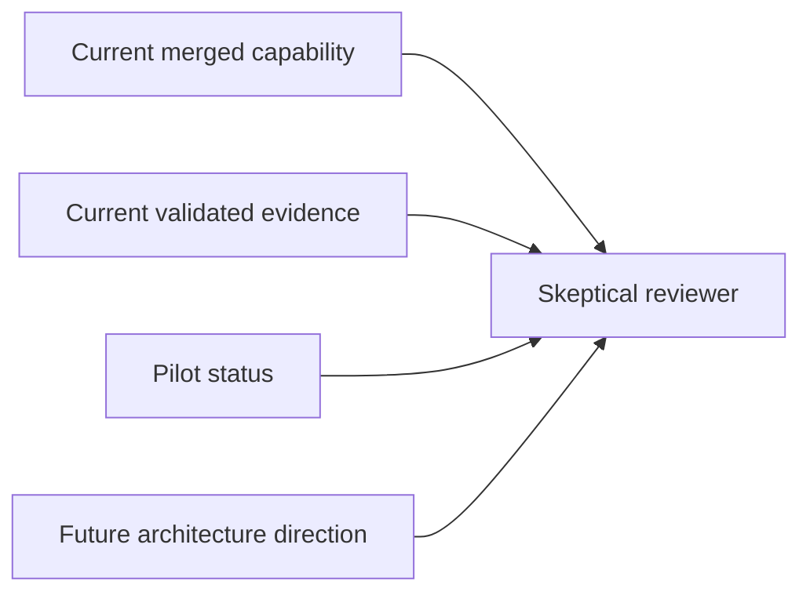

# PR Note: Risk Lane 6 Claim Calibration And Pilot

## Summary

This PR hardens contest defense by aligning all major narrative surfaces around the project’s actual proof level: validated prototype now, bounded evidence now, and future multi-agent role separation later.

## What Changed

- calibrated contest-facing docs to distinguish current capability, current evidence, and future direction
- added `PILOT_STATUS.md` as the single honest answer to pilot or external-feedback questions
- aligned compatibility snapshots and competition wording with the same prototype-level framing

## Main System Map

- `ai_first/architecture/MAIN_SYSTEM_MAP.md` was not updated because this lane changes wording and evidence framing, not shipped architecture boundaries

## Diagram

