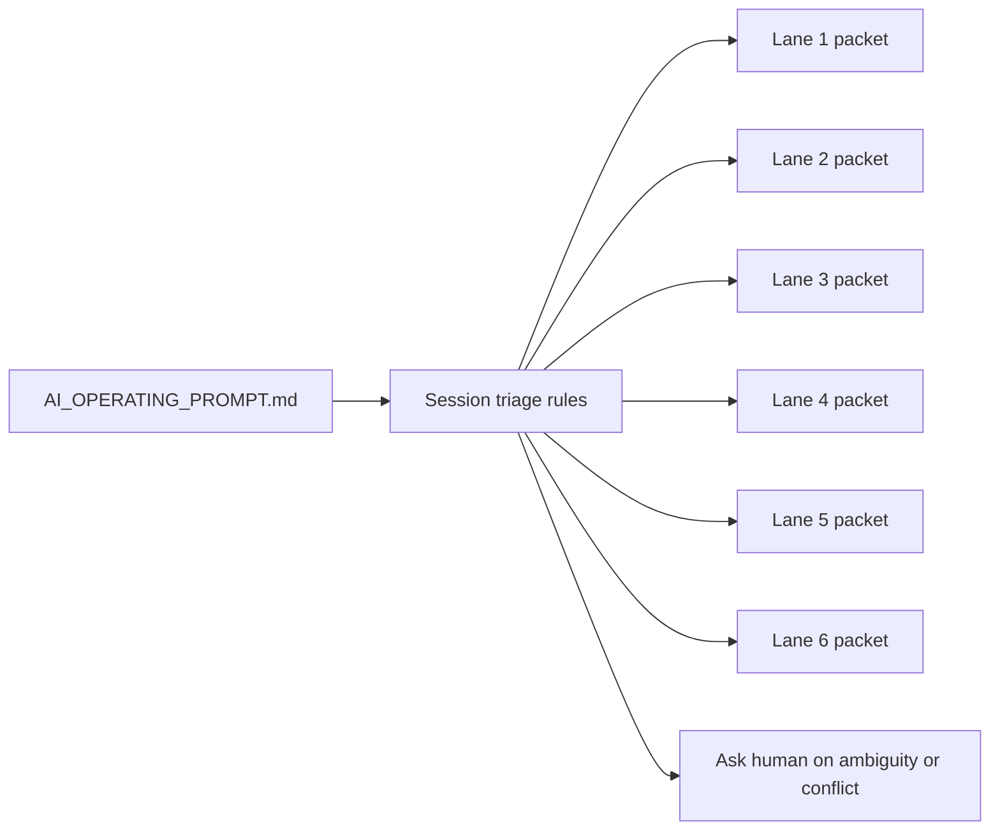

# PR Note: Six Lane Session Packets

## Summary

- add six session-ready lane packets so future AI sessions can start from `main` with explicit ownership
- refresh `ai_first/AI_OPERATING_PROMPT.md` so it can route an AI worker, detect session ambiguity, ask the human, and recommend a safe lane
- update AI-first queue and compatibility mirrors for the new multi-session operating mode

## Architecture

## Validation

- `rg -n "lane-1|lane-2|lane-3|lane-4|lane-5|lane-6|Session triage rules|1 session = 1 lane" ai_first docs/superpowers/tasks -S`
- `git diff --check`

## Main System Map

- Not updated; this PR is docs/workflow-only and does not change product/runtime architecture.
