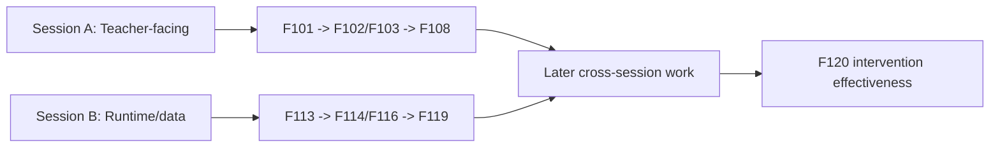

# Two-Session Future Backlog PR Note

## Changed

- extended `ai_first/TASK_REGISTRY.json` with `F101-F124`
- added `recommended_session_bucket` and `layer` fields for the future backlog slice
- added the startup packet at `docs/superpowers/tasks/2026-04-26-two-session-future-backlog.md`
- updated compact AI-first mirrors so future workers are routed to the new backlog packet instead of merged contest lanes

## Why

The contest MVP and risk-hardening lanes are complete, but the product still has major missing or thin capabilities. Without a new backlog slice, future AI workers would either improvise tasks or reopen merged lanes incorrectly. This PR gives the repository a machine-readable next layer of product work while preserving the current terminal state that no implementation task is active by default.

## Coordination Model

## Main System Map

`ai_first/architecture/MAIN_SYSTEM_MAP.md` is not updated. This PR changes task planning and AI-first coordination only; it does not change product/runtime architecture.

## Tests run

- `python -m json.tool ai_first/TASK_REGISTRY.json >/dev/null`
- `rg -n 'F10[1-9]|F11[0-9]|F12[0-4]|recommended_session_bucket|layer|\"status\": \"not-started\"' ai_first/TASK_REGISTRY.json -n -S`
- `rg -n 'TODO|TBD|implement later|ad hoc|<teacher-facing-task>|<runtime-data-task>' docs/superpowers/tasks/2026-04-26-two-session-future-backlog.md -S`
- `rg -n 'F101|F124|two-session future backlog|two-session startup packet|future backlog packet' ai_first/AI_OPERATING_PROMPT.md ai_first/CURRENT_STATE.md ai_first/NEXT_ACTIONS.md ai_first/daily/2026-04-26.md -S`
- `git diff --check`

## Risks

- The new backlog is intentionally long-range. Future workers still need a concrete packet per `F` task before implementation starts.
- Some future tasks depend on shared contracts that may justify splitting work into more than two sessions later. The packet documents this as a coordination boundary, not a guarantee that two sessions will always be sufficient.

## Next AI should read

1. `AGENTS.md`
2. `ai_first/AI_OPERATING_PROMPT.md`
3. `ai_first/TASK_REGISTRY.json`
4. `docs/superpowers/tasks/2026-04-26-two-session-future-backlog.md`

## Suggested next action

Open a Draft PR for this docs lane. After merge, future AI work should start from a concrete `F` task packet on a fresh branch from `main`.
