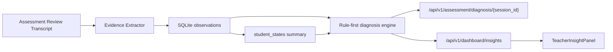

# PR Note: Wave 1 Evidence Spine

## Summary

- add a new evidence service layer for observation extraction, rule-first diagnosis, and teacher insight aggregation
- persist observations and student-state summaries in the unified SQLite session store
- expose structured assessment diagnosis and teacher dashboard insight payloads
- surface the structured teacher insight panel on the dashboard

## Architecture

## Validation

- `pytest tests/services/evidence/test_extractor.py tests/services/evidence/test_diagnosis.py tests/services/session/test_sqlite_store.py tests/api/test_assessment_router.py tests/api/test_dashboard_router.py -q`
- `eslint --config eslint.config.mjs app/'(workspace)'/dashboard/page.tsx lib/dashboard-api.ts components/dashboard/TeacherInsightPanel.tsx`
- `git diff --check`

## Main System Map

- Updated `ai_first/architecture/MAIN_SYSTEM_MAP.md` to include the Wave 1 evidence spine and structured teacher insight panel.
