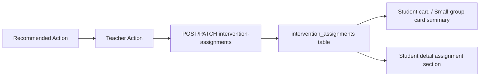

# F102 Intervention Assignment Flow PR Note

## Changed

- added a bounded `intervention_assignments` backend contract inside the dashboard/evidence layer
- added dashboard APIs:
  - `POST /api/v1/dashboard/intervention-assignments`
  - `PATCH /api/v1/dashboard/intervention-assignments/{assignment_id}`
- attached intervention assignment summaries back onto student and small-group insight payloads
- added an intervention assignment composer for teacher-created follow-up activities
- added an `Intervention assignments` section on student detail with bounded status updates
- updated `ai_first/architecture/MAIN_SYSTEM_MAP.md`

## Why

`F101` let teachers convert AI recommendations into structured teacher actions, but the product still stopped short of a concrete remediation artifact. `F102` adds the next bounded step: a teacher-facing intervention assignment shell linked to a teacher action, while deliberately avoiding a full assignment delivery or classroom-operations system.

## Architecture

## Main System Map

`ai_first/architecture/MAIN_SYSTEM_MAP.md` **was updated** because this PR adds a new dashboard API surface and a new teacher-facing intervention assignment data flow.

## Tests run

- `pytest tests/api/test_dashboard_router.py -k "teacher_action or intervention_assignment or dashboard_insights" -q`
- `cd web && ./node_modules/.bin/eslint --config eslint.config.mjs components/dashboard/InterventionAssignmentComposer.tsx components/dashboard/StudentInsightCard.tsx components/dashboard/SmallGroupInsightCard.tsx components/dashboard/StudentInsightDetail.tsx lib/dashboard-api.ts`
- `git diff --check`

## Risks

- intervention assignments are still teacher-facing records only, not student-delivered assignments
- this first pass does not add due dates, notifications, class roster links, or completion tracking
- the model assumes a teacher action exists before an intervention assignment can be created

## Next AI should read

1. `docs/superpowers/tasks/2026-04-27-f102-intervention-assignment-flow.md`
2. `docs/superpowers/specs/2026-04-27-f102-intervention-assignment-flow-design.md`
3. `docs/superpowers/plans/2026-04-27-f102-intervention-assignment-flow.md`

## Suggested next action

If this lands cleanly, the most natural follow-ups are:
- `F103_RECOMMENDATION_ACKNOWLEDGEMENT_AND_STATUS`
- `F107_INTERVENTION_HISTORY_VIEW`
- `F120_INTERVENTION_EFFECTIVENESS_TRACKING`
