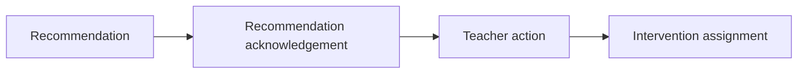

# PR Note: F103 Recommendation Acknowledgement And Status

## Summary

This PR adds a bounded teacher-facing acknowledgement layer for dashboard recommendations so the teacher can explicitly mark a recommendation as accepted, deferred, dismissed, or completed before or without creating a teacher action or intervention assignment.

## What Changed

- added `recommendation_acks` storage and create/update dashboard endpoints
- attached the latest acknowledgement summary to both student and small-group insight payloads
- added compact acknowledgement controls on student and small-group cards
- added a recommendation acknowledgement summary section in student detail
- kept acknowledgement semantics separate from execution (`teacher_action`) and delivery (`intervention_assignment`)

## Main System Map

- `ai_first/architecture/MAIN_SYSTEM_MAP.md` was updated because this PR adds a new teacher-facing dashboard API boundary and a new evidence-side record type

## Diagram

