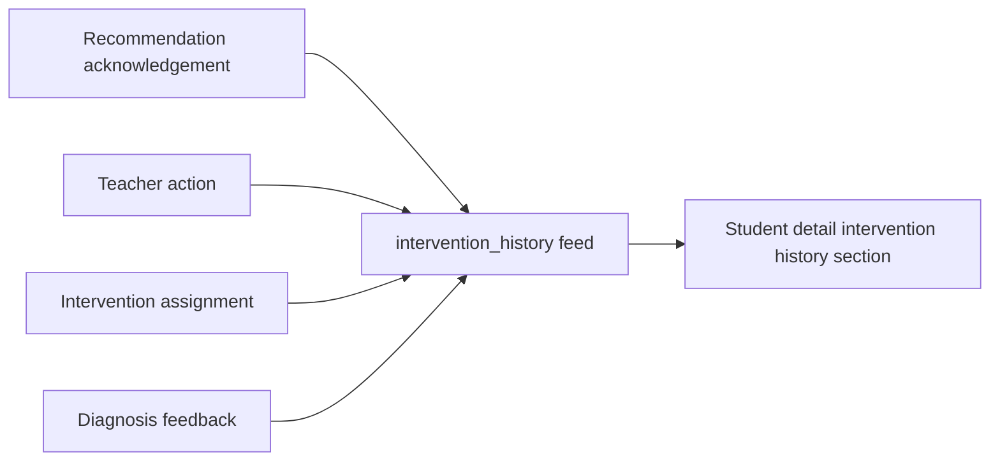

# PR Note: F107 Intervention History View

## Summary

- derive a normalized per-student `intervention_history` feed from existing dashboard evidence records
- expose the feed on teacher insights payloads without creating a new persistence layer
- render the history timeline on student detail so teachers can inspect the order of prior intervention-related steps

## Architecture Impact

- Product/runtime architecture stays the same
- Dashboard/evidence shaping now includes one derived history feed for student detail
- No new tables or execution workflows are introduced

## Mermaid

## MAIN_SYSTEM_MAP

- Updated `ai_first/architecture/MAIN_SYSTEM_MAP.md` to show the student-detail intervention history timeline.
