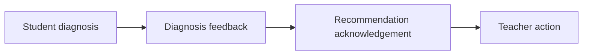

# PR Note: F108 Diagnosis Feedback Capture

## Summary

This PR adds a bounded teacher-facing diagnosis-feedback layer so teachers can mark a student diagnosis as helpful, wrong, or incomplete with an optional note.

## What Changed

- added `diagnosis_feedback` storage and create/update dashboard endpoints
- attached the latest diagnosis feedback summary to the per-student insight payload
- added compact diagnosis-feedback controls to the student card and student detail diagnosis section
- kept diagnosis feedback separate from recommendation acknowledgement, teacher actions, and intervention assignments

## Main System Map

- `ai_first/architecture/MAIN_SYSTEM_MAP.md` was updated because this PR adds a new diagnosis-feedback API/data-flow boundary inside the teacher dashboard

## Diagram

