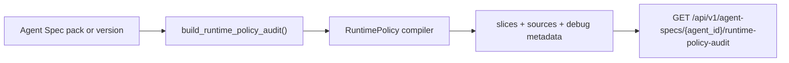

# PR Note: F115 Runtime Policy Audit Trace

- Task: `F115_RUNTIME_POLICY_AUDIT_TRACE`
- Scope: bounded backend audit contract for inspectable runtime-policy traces
- Main-system-map update: required and included in this branch

## What Changed

- added a runtime-policy audit helper that builds a serializable trace for a selected Agent Spec and capability
- reused `F114` version-fetch support so audit calls can inspect either the latest pack or an exact historical version
- exposed `GET /api/v1/agent-specs/{agent_id}/runtime-policy-audit` for bounded backend inspection
- kept the surface policy-centric and avoided exposing session-history or teacher-facing UI in this task

## Validation

- `pytest tests/services/runtime_policy/test_compiler.py tests/api/test_agent_specs_router.py -q`
- `python -m json.tool ai_first/TASK_REGISTRY.json >/dev/null`
- `git diff --check`
