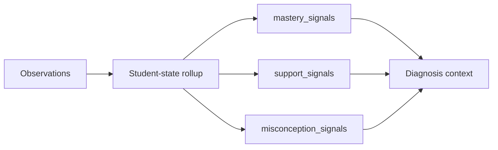

# PR Note: F116 Student Model Enrichment

- Task: `F116_STUDENT_MODEL_ENRICHMENT`
- Scope: bounded enrichment of stored student-state signals
- Main-system-map update: required and included in this branch

## What Changed

- extended persisted student state beyond recency-only fields with additive `mastery_signals`, `support_signals`, and `misconception_signals`
- kept diagnosis observation-first while allowing enriched state to pass through as bounded context
- updated session context formatting so richer student-state signals are readable downstream without introducing opaque scores

## Validation

- `pytest tests/services/session/test_sqlite_store.py tests/services/evidence/test_diagnosis.py -q`
- `python -m json.tool ai_first/TASK_REGISTRY.json >/dev/null`
- `git diff --check`
