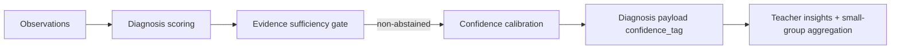

# PR Note: F117 Confidence Calibration Refinement

## Summary

- adds a bounded confidence-calibration helper for diagnosis payloads
- ties `confidence_tag` to evidence density, 24h recency presence, and recent support burden
- preserves the `F119` abstain gate while making non-abstained confidence tags more conservative

## Architecture Impact

- `ai_first/architecture/MAIN_SYSTEM_MAP.md`: updated
- Reason: diagnosis now uses an explicit confidence-calibration seam alongside the evidence-sufficiency gate

## Flow

## Validation

- `pytest tests/services/evidence/test_diagnosis.py tests/api/test_assessment_router.py tests/api/test_dashboard_router.py -q`
- `python -m json.tool ai_first/TASK_REGISTRY.json >/dev/null`
- `git diff --check`
