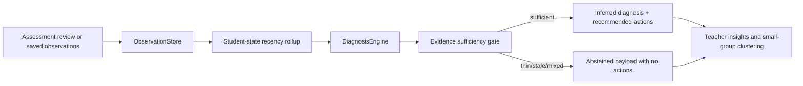

# PR Note: F119 Abstain And Weak-Evidence Refinement

## Summary

- adds a shared evidence-sufficiency gate for `thin_evidence`, `stale_evidence`, and `mixed_evidence`
- preserves assessment review timestamps when saving observations so recency rollups can distinguish stale history from fresh evidence
- suppresses diagnosis-derived recommendations and downstream small-group recommendations when evidence is too weak or stale

## Architecture Impact

- `ai_first/architecture/MAIN_SYSTEM_MAP.md`: updated
- Reason: the diagnosis layer now includes an explicit evidence-sufficiency gate that sits between observation rollups and recommendation emission

## Flow

## Validation

- `pytest tests/services/evidence/test_diagnosis.py tests/api/test_assessment_router.py tests/api/test_dashboard_router.py -q`
- `python -m json.tool ai_first/TASK_REGISTRY.json >/dev/null`
- `git diff --check`
