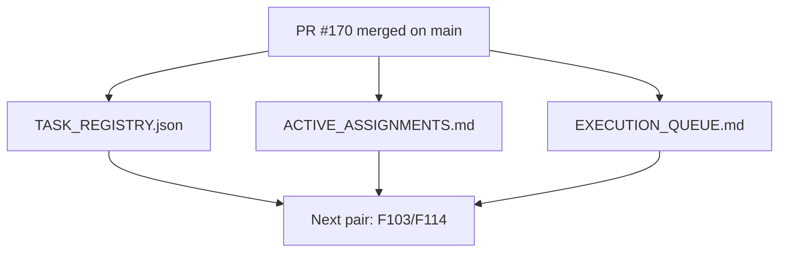

# PR Architecture Note: Post-170 F102 Control-Plane Sync

## Summary

This PR synchronizes the AI-first control plane after `F102_INTERVENTION_ASSIGNMENT_FLOW` merged to `main`. It clears the active Session A assignment from `main`, marks `F102` as completed in the task registry, and advances the future-backlog queue to the next clean Session A / Session B pair.

## Mermaid Diagram



## Files Changed

- `ai_first/ACTIVE_ASSIGNMENTS.md`
- `ai_first/EXECUTION_QUEUE.md`
- `ai_first/TASK_REGISTRY.json`
- `ai_first/daily/2026-04-26.md`
- `docs/superpowers/pr-notes/2026-04-27-post-170-f102-sync.md`

## Main System Map Update

`ai_first/architecture/MAIN_SYSTEM_MAP.md` was not updated. This PR only synchronizes AI-first task state after `F102` merged; it does not change runtime topology or product architecture.

## Validation

```bash
python -m json.tool ai_first/TASK_REGISTRY.json >/dev/null
git diff --check
```

## Handoff Notes

- `F102_INTERVENTION_ASSIGNMENT_FLOW` is complete on `main`.
- No AI implementation lane remains active by default after this sync lands.
- The next safe product pair is `F103/F107` for Session A and `F114/F116` for Session B.
