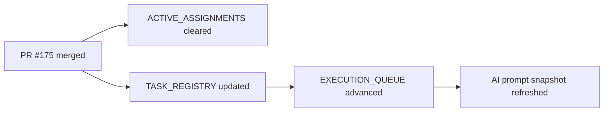

# PR Note: Post-175 F103 Control-Plane Sync

## Summary

This PR resets the AI-first control plane after `F103_RECOMMENDATION_ACKNOWLEDGEMENT_AND_STATUS` merged so `main` no longer advertises an active Session A task and the future backlog pointers stay consistent.

## What Changed

- cleared the stale `F103` active assignment from `ai_first/ACTIVE_ASSIGNMENTS.md`
- marked `F103` completed in `ai_first/TASK_REGISTRY.json`
- normalized stale `F104-F107` object-level task statuses back to `not-started`
- advanced `ai_first/EXECUTION_QUEUE.md` to the next recommended future-backlog pair
- refreshed `ai_first/AI_OPERATING_PROMPT.md` product-status snapshot with recommendation acknowledgement flow

## Main System Map

- `ai_first/architecture/MAIN_SYSTEM_MAP.md` was not updated because this PR only syncs AI-first operating state after a merged feature

## Diagram

