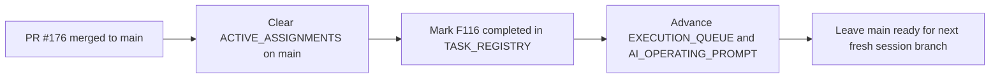

# PR Note: Post-176 F116 Sync

## Summary

- clears the stale Session B active assignment left on `main` after `F116`
- marks `F116_STUDENT_MODEL_ENRICHMENT` completed in the task registry
- advances the compact queue and operating prompt so the next Session B recommendation no longer points at a merged task

## Architecture Impact

- `ai_first/architecture/MAIN_SYSTEM_MAP.md`: not updated
- Reason: this PR only syncs the AI-first control plane after a merged feature; it does not change runtime contracts or system structure

## Control-Plane Flow

## Validation

- `python -m json.tool ai_first/TASK_REGISTRY.json >/dev/null`
- `git diff --check`
