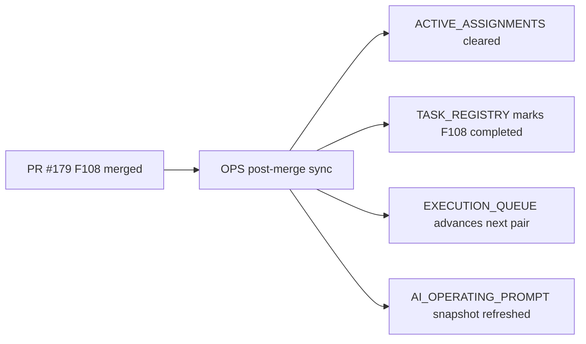

# PR Note: OPS Post-179 F108 Sync

## Summary

- clear the stale active assignment left on `main` after `F108`
- mark `F108_DIAGNOSIS_FEEDBACK_CAPTURE` completed in the registry
- refresh the execution queue and prompt snapshot so the next recommended Session A pair moves past `F108`

## Architecture Impact

- No product/runtime architecture change
- Control-plane only

## Mermaid

## MAIN_SYSTEM_MAP

- No update required; this PR only syncs AI-first operating files after the feature merge.
