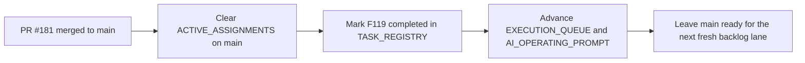

# PR Note: Post-181 F119 Sync

## Summary

- clears the stale Session B assignment left on `main` after `F119`
- marks `F119_ABSTAIN_AND_WEAK_EVIDENCE_REFINEMENT` completed in the task registry
- advances the Session B next pair so the compact queue no longer points at a merged task

## Architecture Impact

- `ai_first/architecture/MAIN_SYSTEM_MAP.md`: not updated
- Reason: this PR only synchronizes the AI-first control plane after a merged feature; it does not change runtime contracts or system structure

## Control-Plane Flow

## Validation

- `python -m json.tool ai_first/TASK_REGISTRY.json >/dev/null`
- `git diff --check`
