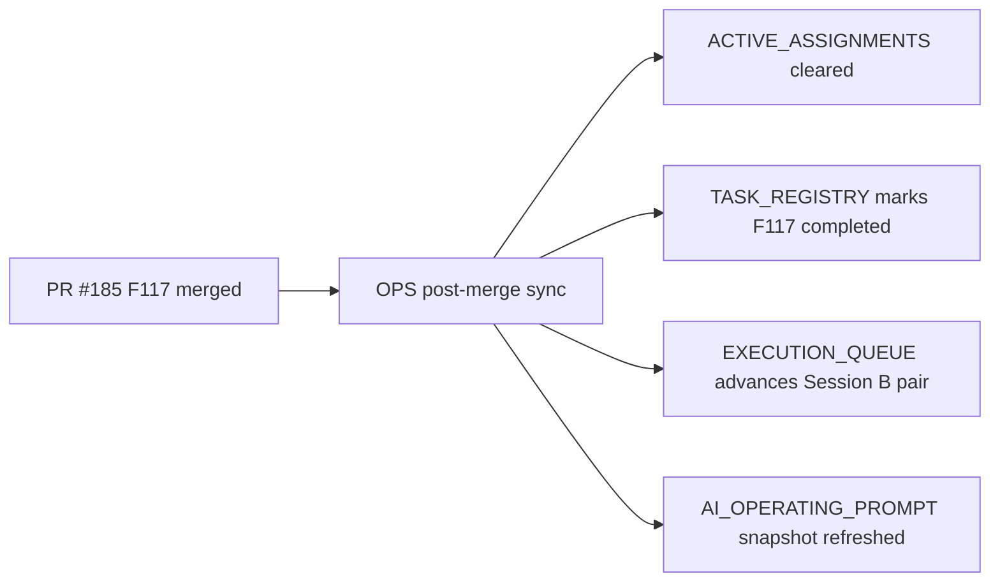

# PR Note: OPS Post-185 F117 Sync

## Summary

- clear the stale `F117` active assignment left on `main`
- mark `F117_CONFIDENCE_CALIBRATION_REFINEMENT` completed in the registry
- refresh the queue and prompt snapshot so the next Session B pair advances past `F117`

## Architecture Impact

- No product/runtime architecture change
- Control-plane only

## Mermaid

## MAIN_SYSTEM_MAP

- No update required; the feature PR already updated `ai_first/architecture/MAIN_SYSTEM_MAP.md`.
