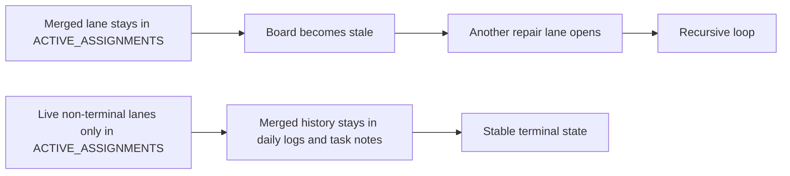

# PR Note: Active Assignments Policy Fix

## Summary

- redefine `ai_first/ACTIVE_ASSIGNMENTS.md` as a board for live non-terminal lanes only
- remove merged submission-close lanes from the active board to stop recursive terminal-sync churn
- keep merged history in the daily log and packet/PR-note chain instead of the active board

## Mermaid Diagram

## Architecture Impact

`ai_first/architecture/MAIN_SYSTEM_MAP.md` is not updated. This change only fixes the AI-first coordination policy and mirror behavior.
