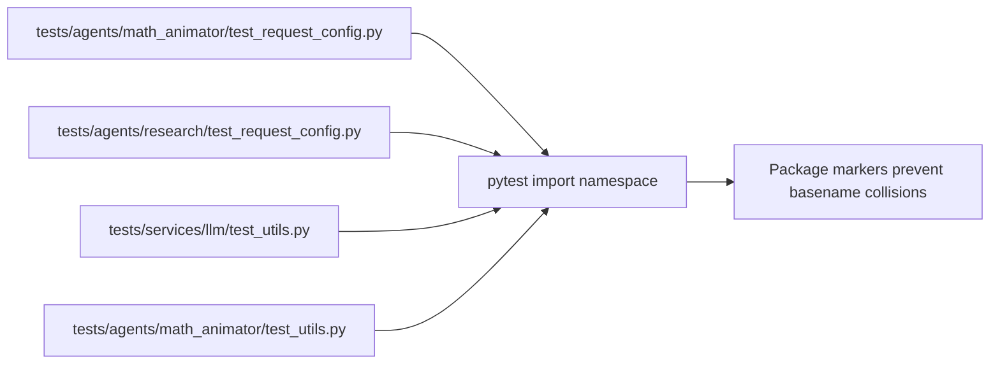

# PR Note: Baseline Pytest Collection Blocker

## Summary

- add minimal test package markers to prevent duplicate basename collisions during pytest collection
- keep the fix scoped to `tests/` layout stabilization
- document that post-collection baseline failures remain out of scope for this branch

## Mermaid

## Main System Map

- Not updated. This fix affects test discovery only.
