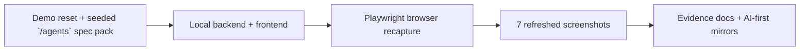

# PR Note: Browser Recapture After Phase 2 Execution

## Summary

This PR executes the previously prepared browser recapture packet against the current merged Phase 2 UI. It refreshes the seven stale Knowledge, Tutor, Dashboard, and `/agents` screenshots, then updates contest evidence docs and AI-first mirrors so those rows return to `Current` without widening any product claims.

## Mermaid Diagram



## Architecture Impact

`ai_first/architecture/MAIN_SYSTEM_MAP.md` is not updated. This lane refreshes evidence artifacts and docs only; it does not change runtime behavior or system architecture.

## Validation

```bash
/Users/nguyenhuuloc/Documents/Multiagent-learning-platform/.venv/bin/python -m scripts.contest.reset_demo_data --project-root . --api-base http://localhost:8001
curl -s http://127.0.0.1:8001/api/v1/system/status
node /tmp/recapture_phase2.cjs
rg -n "Stale|Current|browser recapture|Knowledge Pack|Tutor Agent|Dashboard|/agents|screenshots" docs/contest ai_first docs/superpowers/tasks docs/superpowers/pr-notes -S
git diff --check
```

## Handoff Notes

- The fresh 2026-04-28 recapture covers `01`, `02`, `05`, `06`, `09`, `10`, and `11` in `docs/contest/screenshots/`.
- Assessment screenshots remain current from 2026-04-25 because Phase 2 did not change the assessment-specific browser flow.
- `/agents` proof still stays bounded to teacher authoring/export plus the separately documented automated runtime-binding proof.
