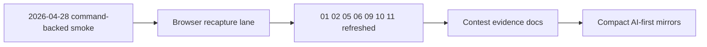

# PR Note: Browser Recapture After Phase 2 Execution

## Summary

This PR executes the existing browser-recapture packet on current `main`. It refreshes the stale Knowledge, Tutor, Dashboard, and `/agents` screenshots against the merged Phase 2 UI, updates the contest evidence docs to move those rows back to `Current`, and returns the compact AI-first mirrors to a human-review terminal state.

## Mermaid Diagram



## Architecture Impact

`ai_first/architecture/MAIN_SYSTEM_MAP.md` is not updated. This lane refreshes browser evidence and operating mirrors only; it does not change runtime or shared product architecture.

## Validation

```bash
/Users/nguyenhuuloc/Documents/Multiagent-learning-platform/.venv/bin/python -m deeptutor_cli.main serve --host 127.0.0.1 --port 8001
/Users/nguyenhuuloc/Documents/Multiagent-learning-platform/.venv/bin/python -m scripts.contest.reset_demo_data --project-root . --api-base http://localhost:8001
curl -s http://127.0.0.1:8001/api/v1/system/status
curl -s -X POST http://127.0.0.1:8001/api/v1/agent-specs ...
cd web && npm ci && npm run dev
rg -n "Stale|Current|browser recapture|Knowledge Pack|Tutor Agent|Dashboard|/agents|screenshots" docs/contest ai_first docs/superpowers/tasks docs/superpowers/pr-notes -S
git diff --check
```
