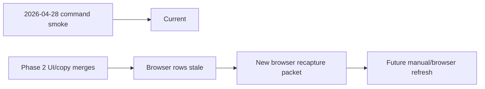

# PR Note: Browser Recapture After Phase 2 Packet

## Summary

- adds the next execution packet for manual/browser screenshot recapture after the merged Phase 2 polish train
- updates the AI-first mirrors so the repo points to a concrete recapture lane instead of a generic future intent
- keeps current evidence truth unchanged: command-backed proof is current, affected browser screenshots remain stale until recaptured

## Architecture impact

- `ai_first/architecture/MAIN_SYSTEM_MAP.md` not updated
- reason: this lane only adds workflow/packet guidance for evidence recapture

## Mermaid

