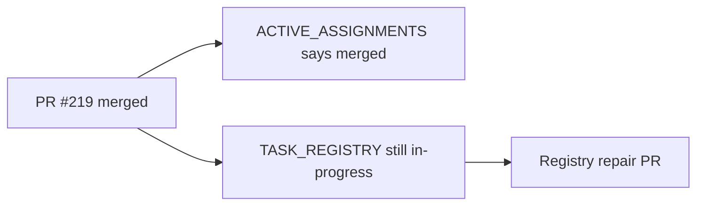

# PR Note: C211 Registry Terminal Repair

## Summary

- mark `C211_TEACHER_FIRST_ENTRY_POLISH` completed in the authoritative task registry
- record the tiny control-plane repair lane in the daily log and active-assignment board
- leave runtime, evidence, and browser-capture state unchanged

## Architecture Impact

- No runtime or product modules changed.
- This PR only repairs AI-first task-tracking metadata.
- `ai_first/architecture/MAIN_SYSTEM_MAP.md` was not updated because no system contract changed.

## Mermaid

