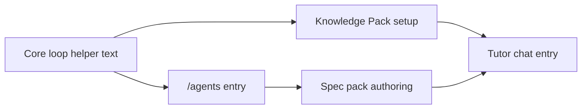

# PR Note: C211 Teacher-First Entry Polish

## Summary

- reframe the teacher entry surfaces so the product reads first as a classroom tutor setup flow
- tighten class-tutor wording on `/agents`, spec-pack authoring, Knowledge Pack setup, and Tutor chat empty state
- keep the work bounded to copy and presentation cues without changing runtime behavior or contest claim scope

## Mermaid Diagram



## Architecture Impact

`ai_first/architecture/MAIN_SYSTEM_MAP.md` is not updated. This PR only adjusts teacher-entry wording and presentation cues on existing UI surfaces.

## Validation

```bash
python3 -m json.tool ai_first/TASK_REGISTRY.json >/dev/null
git diff --check
cd web && npx eslint "app/(utility)/knowledge/page.tsx" "app/(workspace)/agents/page.tsx" "app/(workspace)/agents/[botId]/chat/page.tsx" "components/agents/SpecPackAuthoringTab.tsx" "components/contest/CoreLoopVisibilityStrip.tsx"
cd web && npm run build
```

## Handoff Notes

- The lane intentionally avoids `docs/contest/*`, screenshot inventory, and runtime logic.
- The existing Next.js multiple-lockfile warning still appears during `npm run build`, but the build completes successfully.
