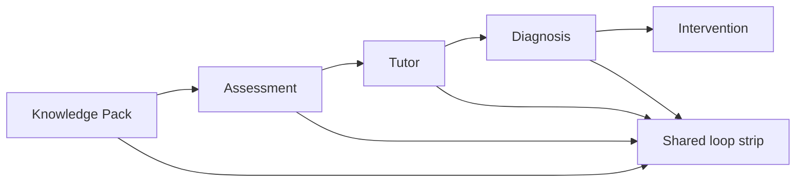

# PR Note: C212 Core Loop Visibility Polish

## Summary

- add a shared contest-loop visibility strip for existing product screens
- show the five-step loop on Knowledge, Assessment, Tutor, and Dashboard
- keep the polish bounded to UI framing without changing runtime behavior or submission docs

## Architecture Impact

- No backend or runtime contracts changed.
- No submission-doc claims changed.
- `ai_first/architecture/MAIN_SYSTEM_MAP.md` was not updated because this PR is bounded UI polish only.

## Mermaid

