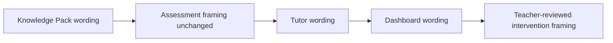

# PR Note: C213 Differentiation Wording Sweep

## Summary

- aligns bounded contest-facing UI copy with the teacher-controlled adaptive tutor framing
- keeps the same routes, components, and runtime behavior
- updates AI-first mirrors so `C212` is recorded completed and `C213` is tracked as the active optional polish lane

## Architecture impact

- `ai_first/architecture/MAIN_SYSTEM_MAP.md` not updated
- reason: this lane changes wording only and does not alter routes, components, data flow, or runtime contracts

## Mermaid

