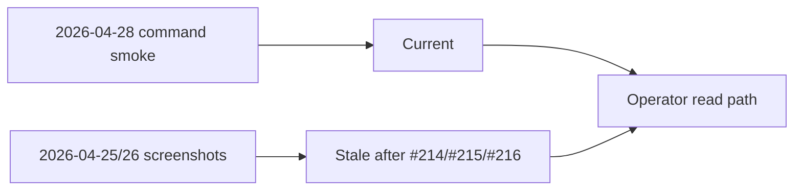

# PR Note: C215 Post-Polish Evidence Recapture

## Summary

- updates contest evidence docs so browser screenshot freshness matches the latest merged UI state
- preserves the 2026-04-28 command-backed smoke evidence as current
- syncs AI-first mirrors so `C214` is completed and `C215` is the active evidence-alignment lane

## Architecture impact

- `ai_first/architecture/MAIN_SYSTEM_MAP.md` not updated
- reason: this lane only changes evidence freshness documentation

## Mermaid

