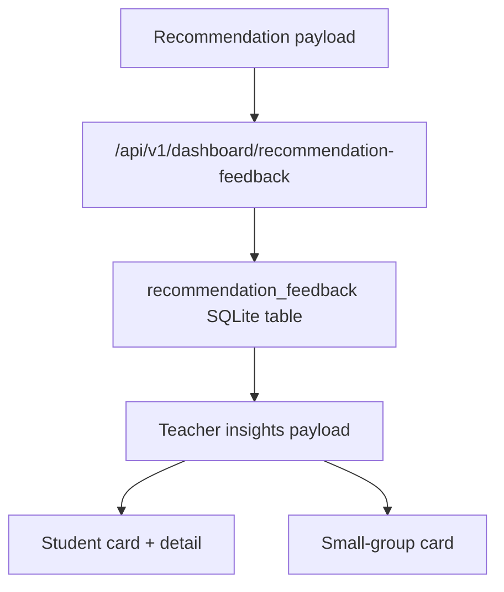

# F109 Recommendation Feedback Capture

## Summary

- adds a dedicated `recommendation_feedback` record for teacher feedback on recommendation quality
- supports both `student` and `small_group` targets
- surfaces the latest recommendation feedback on dashboard student cards, small-group cards, and student detail

## Architecture

## Boundaries

- keeps recommendation-quality feedback separate from:
  - recommendation acknowledgement
  - diagnosis feedback
  - teacher action execution
- does not add analytics, engine adaptation, or new routes

## Validation

- `pytest tests/api/test_dashboard_router.py -k "recommendation_feedback" -q`
- `pytest tests/api/test_dashboard_router.py -k "recommendation_feedback or recommendation_ack or diagnosis_feedback or teacher_action or intervention_assignment" -q`
- `python -m json.tool ai_first/TASK_REGISTRY.json >/dev/null`
- `git diff --check`

## MAIN_SYSTEM_MAP

- Updated: `yes`
