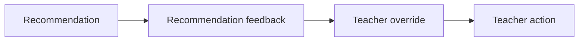

# PR Note: F110 Teacher Override Log

## Summary

This PR adds a bounded teacher-override layer so teachers can explicitly replace a recommendation with a different classroom move for both individual students and small groups.

## What Changed

- added `teacher_override` storage plus create/update dashboard endpoints
- attached the latest teacher override summary to student and small-group insight payloads
- added compact override controls to student cards, small-group cards, and student detail
- kept overrides separate from recommendation feedback, acknowledgement, teacher actions, and intervention assignments

## Main System Map

- `ai_first/architecture/MAIN_SYSTEM_MAP.md` was updated because this PR adds a new teacher-override API/data-flow boundary inside the teacher dashboard

## Diagram

