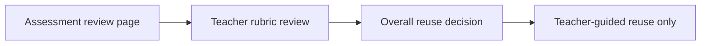

# PR Note: F111 Assessment Review Rubric Controls

## Summary

This PR adds a bounded teacher-review rubric to the existing assessment review route so teachers can record structured quality judgments before reusing an assessment.

## What Changed

- added a persisted `teacher_review` record keyed by `session_id`
- extended `GET /api/v1/sessions/{session_id}/assessment-review` with `teacher_review`
- added `POST/PATCH /api/v1/sessions/{session_id}/assessment-rubric-review`
- added a rubric review card under the existing teacher safety gate on the assessment review page
- kept the feature separate from publishing, dashboard rollups, and student-facing approval semantics

## Main System Map

- `ai_first/architecture/MAIN_SYSTEM_MAP.md` was updated because this PR adds a new assessment-review API/data-flow boundary

## Diagram

