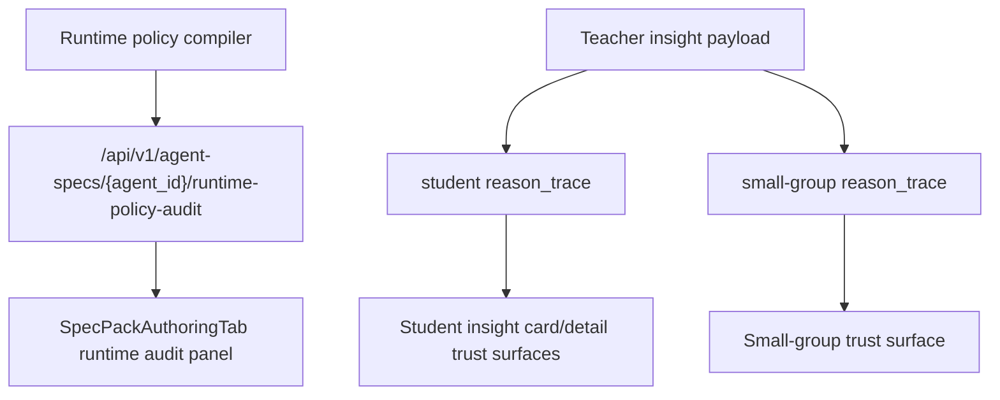

# PR Note: F112 Provenance And Reason Trace Surfaces

## Summary

- add bounded student and small-group trust traces to teacher insight payloads
- surface diagnosis policy, evidence, and teacher-review framing in dashboard trust UI
- surface runtime-policy audit details for agent specs on `/agents`

## Architecture

## MAIN_SYSTEM_MAP

- Updated `ai_first/architecture/MAIN_SYSTEM_MAP.md` to include runtime audit and teacher insight trust surfaces.

## Validation

- `pytest tests/api/test_dashboard_router.py -k "dashboard_insights_returns_students_and_small_groups or preserve_procedure_breakdown_taxonomy_for_small_groups or skips_small_groups_for_stale_evidence" -q`
- `pytest tests/api/test_agent_specs_router.py -k "runtime_policy_audit" -q`
- `./web/node_modules/.bin/eslint --config web/eslint.config.mjs ...`
- `python -m json.tool ai_first/TASK_REGISTRY.json >/dev/null`
- `git diff --check`
