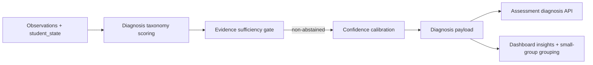

# PR Note: F118 Misconception Taxonomy Expansion

## Summary

- adds a bounded diagnosis-taxonomy helper for classroom-relevant misconception patterns
- expands `diagnosis_type` beyond the MVP four-label set with `procedure_breakdown`, `support_dependency`, and `fluency_gap`
- preserves the `F119` abstain gate and `F117` confidence calibration while allowing assessment and dashboard payloads to surface the richer labels

## Architecture Impact

- `ai_first/architecture/MAIN_SYSTEM_MAP.md`: updated
- Reason: diagnosis now passes through an explicit taxonomy-scoring seam before evidence gating and confidence calibration

## Flow

## Validation

- `pytest tests/services/evidence/test_diagnosis.py tests/api/test_assessment_router.py tests/api/test_dashboard_router.py -q`
- `python -m json.tool ai_first/TASK_REGISTRY.json >/dev/null`
- registry consistency check
- `git diff --check`
