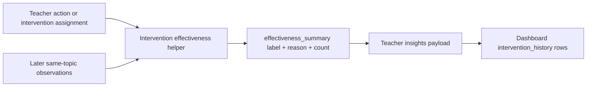

# PR Note: F120 Intervention Effectiveness Tracking

## Summary

- adds a bounded evidence helper that checks later same-topic observations after teacher actions and intervention assignments
- attaches optional `effectiveness_summary` payloads to existing `intervention_history` rows without changing teacher-facing dashboard UX
- keeps the signal observational with labels `appears_helpful`, `mixed_or_unclear`, and `no_followup_signal`

## Architecture Impact

- `ai_first/architecture/MAIN_SYSTEM_MAP.md`: updated
- Reason: teacher insights now expose an explicit observational intervention-effectiveness seam derived from intervention history plus later observations

## Flow

## Validation

- `pytest tests/services/evidence/test_intervention_effectiveness.py tests/api/test_dashboard_router.py -q`
- `python -m json.tool ai_first/TASK_REGISTRY.json >/dev/null`
- registry consistency check
- `git diff --check`
