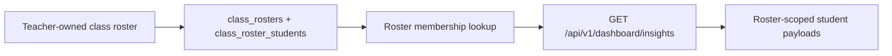

# PR Note: F121 Class Roster And Group Foundation

## Summary

- adds a minimal explicit class-roster persistence seam in the SQLite session store
- introduces teacher-owned roster membership lookup for bounded dashboard ownership filtering
- keeps the slice backend-first and avoids teacher-facing classroom UX expansion

## Architecture Impact

- `ai_first/architecture/MAIN_SYSTEM_MAP.md`: updated
- Reason: the system now exposes an explicit class-roster and ownership seam instead of relying only on loose session metadata like `cohort`

## Flow

## Validation

- `pytest tests/services/session/test_sqlite_store.py -k class_roster -q`
- `pytest tests/api/test_dashboard_router.py -k 'explicit_class_roster or non_owner_teacher_scope' -q`
- `python -m json.tool ai_first/TASK_REGISTRY.json >/dev/null`
- registry consistency check
- `git diff --check`
