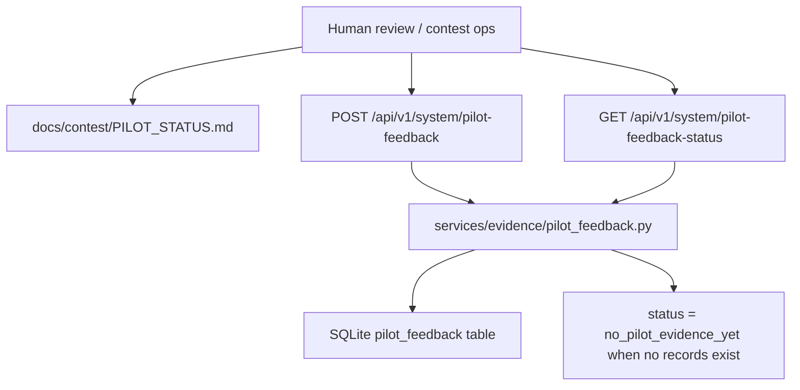

# F122 Pilot Feedback Ingestion Path Architecture Note

## Summary

`F122` adds a bounded validation-ops seam for future external walkthrough or pilot feedback. It does not change teacher-facing dashboard UX and it does not upgrade the repository's current proof level by itself. The empty state remains explicit through `PILOT_STATUS.md` and `/api/v1/system/pilot-feedback-status`.

## Structure

## Notes

- `ai_first/architecture/MAIN_SYSTEM_MAP.md` was updated.
- The route is intentionally system/ops-facing, not a dashboard or classroom workflow surface.
- The contract is safe to leave empty; no seeded pilot data is required or implied.
