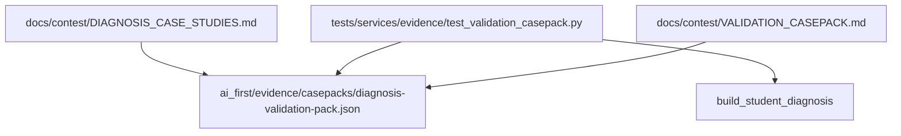

# F123 Casepack And Evaluation Dataset Expansion Architecture Note

## Summary

`F123` adds a reusable validation casepack for diagnosis credibility and abstain behavior. It does not change product runtime or teacher-facing UX. The pack lives under AI-first evidence assets and is verified against current diagnosis behavior by a lightweight regression-style test.

## Structure

## Notes

- `ai_first/architecture/MAIN_SYSTEM_MAP.md` was updated.
- The casepack is a bounded validation artifact, not a benchmark leaderboard.
