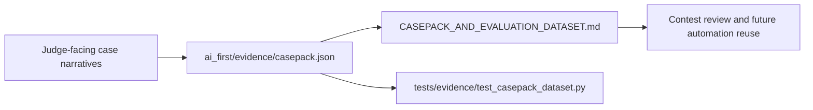

# PR Note: F123 Casepack And Evaluation Dataset Expansion

## Summary

- adds a reusable machine-readable validation casepack under `ai_first/evidence/`
- adds a contest-facing guide for how judges and future AI workers should use the pack
- aligns contest docs with the new structured source-of-truth
- adds a bounded test so the dataset shape does not drift silently

## Architecture Impact

- no runtime or product architecture change
- `ai_first/architecture/MAIN_SYSTEM_MAP.md` update not required for this validation-assets-only PR

## Validation

- `python -m json.tool ai_first/TASK_REGISTRY.json >/dev/null`
- `python -m json.tool ai_first/evidence/casepack.json >/dev/null`
- `pytest tests/evidence/test_casepack_dataset.py -q`
- `git diff --check`
