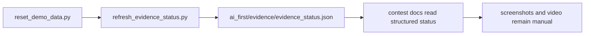

# PR Note: F124 Evidence Automation Refresh

## Summary

- adds a bounded helper to refresh command-backed evidence status
- writes a reusable machine-readable artifact under `ai_first/evidence/`
- updates contest docs to treat command evidence as automation-supported while keeping screenshots and video manual
- adds a small helper test for plan assembly and artifact shape

## Architecture Impact

- no runtime or product architecture changes
- no `ai_first/architecture/MAIN_SYSTEM_MAP.md` update required for this validation-ops-only PR

## Validation

- `python -m json.tool ai_first/TASK_REGISTRY.json >/dev/null`
- `python -m json.tool ai_first/evidence/evidence_status.json >/dev/null`
- `pytest tests/scripts/test_refresh_evidence_status.py -q`
- `git diff --check`
