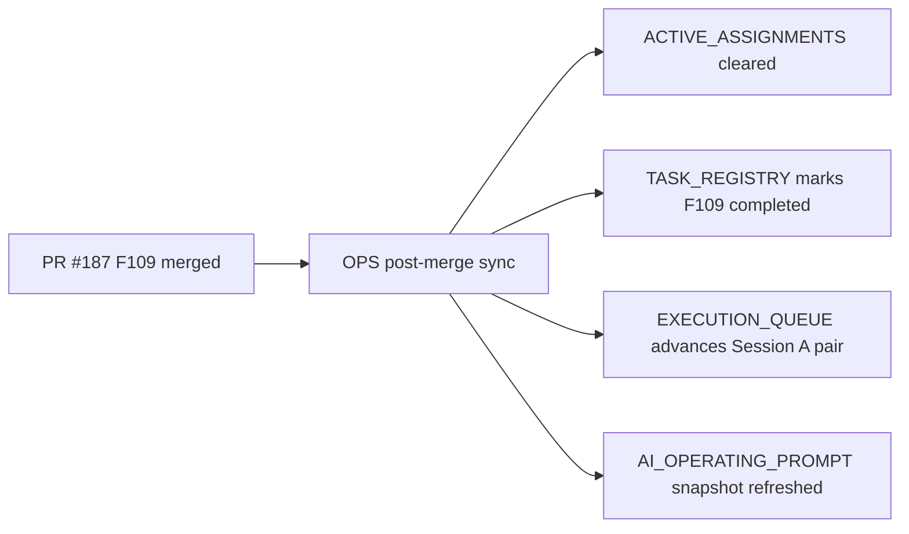

# PR Note: OPS Post-187 F109 Sync

## Summary

- clear the stale `F109` active assignment left on `main`
- mark `F109_RECOMMENDATION_FEEDBACK_CAPTURE` completed in the registry
- refresh the queue and prompt snapshot so the next Session A pair advances past `F109`

## Architecture Impact

- No product/runtime architecture change
- Control-plane only

## Mermaid

## MAIN_SYSTEM_MAP

- No update required; the feature PR already updated `ai_first/architecture/MAIN_SYSTEM_MAP.md`.
