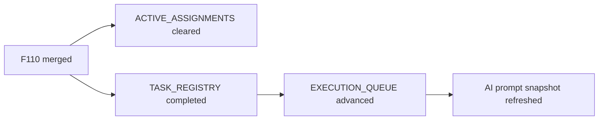

# PR Note: Post-191 F110 Sync

## Summary

This PR resets the AI-first control plane after `F110_TEACHER_OVERRIDE_LOG` merged into `main`.

## What Changed

- removed the stale active Session A assignment for `F110`
- marked `F110` as completed in the task registry
- advanced the execution queue to `F111` / `F112` for Session A and `F120` / `F121` for Session B
- refreshed the operating prompt snapshot to include teacher-override logging in merged product status

## Main System Map

- `ai_first/architecture/MAIN_SYSTEM_MAP.md` was not updated because this PR only changes AI-first control-plane state

## Diagram

