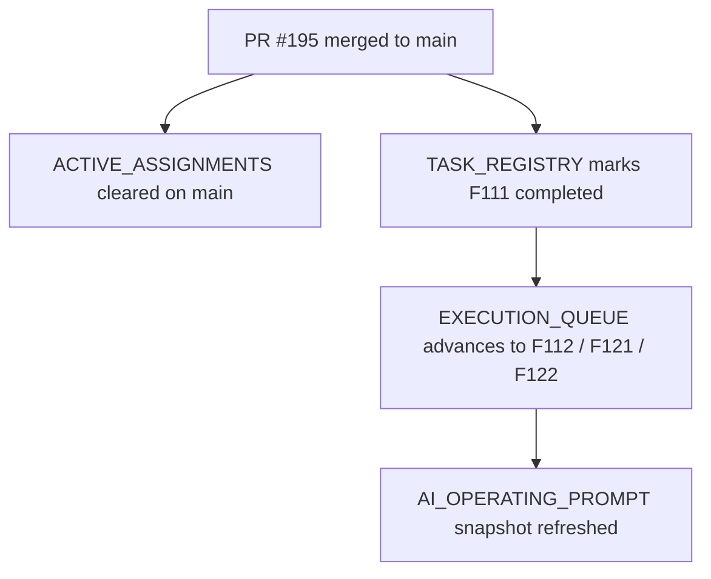

# PR Note: OPS_POST_195_F111_SYNC

## Summary

- remove the stale `F111` active assignment from `main`
- mark `F111_ASSESSMENT_REVIEW_RUBRIC_CONTROLS` completed in the registry
- advance the next future-backlog pair to `F112` plus Session B `F121/F122`
- refresh the operating prompt snapshot to include merged assessment review rubric controls

## Architecture

## MAIN_SYSTEM_MAP

- No update required. This PR only syncs operating/control-plane files after `F111` merged.

## Validation

- `python -m json.tool ai_first/TASK_REGISTRY.json >/dev/null`
- registry consistency check
- `git diff --check`
