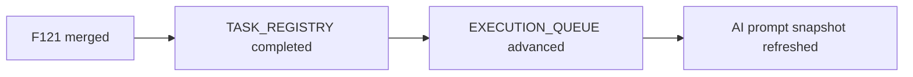

# PR Note: Post-196 F121 Sync

## Summary

This PR resets the AI-first control plane after `F121_CLASS_ROSTER_AND_GROUP_FOUNDATION` merged into `main`.

## What Changed

- marked `F121` as completed in the task registry
- advanced the Session B next pair to `F122` / `F123`
- refreshed the execution queue and operating prompt snapshot to include class roster ownership foundation in merged product status

## Main System Map

- `ai_first/architecture/MAIN_SYSTEM_MAP.md` was not updated because this PR only changes AI-first control-plane state

## Diagram

