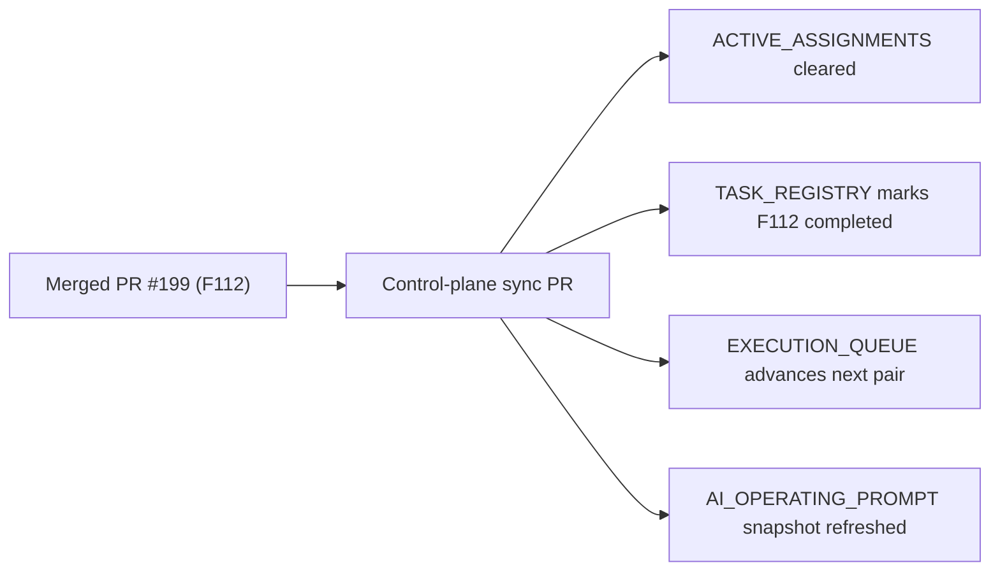

# PR Note: Post-199 F112 Control-Plane Sync

## Summary

- clears the stale `F112_PROVENANCE_AND_REASON_TRACE_SURFACES` assignment from `main`
- marks `F112` as `completed` in the registry and keeps category counts consistent
- advances the execution queue so the next recommended work remains Session B backlog follow-up
- refreshes the AI operating prompt snapshot to reflect merged trust/provenance surfaces

## Architecture Impact

- no runtime or product architecture changes
- no `ai_first/architecture/MAIN_SYSTEM_MAP.md` update required for this sync-only PR

## Validation

- `python -m json.tool ai_first/TASK_REGISTRY.json >/dev/null`
- registry consistency check
- `git diff --check`
