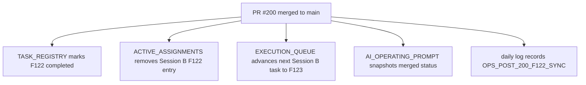

# Post-200 F122 Sync Architecture Note

## Summary

This docs-only sync updates the AI-first control plane after `F122` merged. It does not change product behavior. It removes stale Session B activity from `main`, marks `F122` completed, and advances the next unclaimed Session B lane to `F123`.

## Control Plane Flow

## Notes

- `ai_first/architecture/MAIN_SYSTEM_MAP.md` was not changed by this sync because the feature PR already carried the architecture update.
